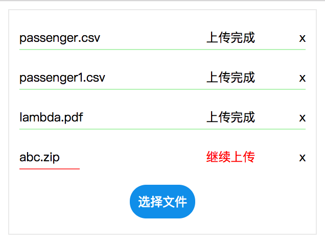
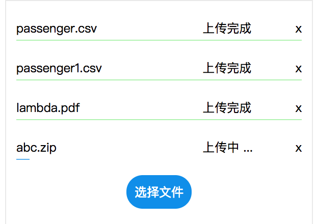

## react-large-uploader
React component for uploading large file 


[](https://travis-ci.org/sunyongjian/react-large-uploader)
[](https://www.npmjs.com/package/react-large-uploader)
[](https://www.npmjs.com/package/react-large-uploader)

### Installation
请安装最新版本

```
npm install react-large-uploader --save
or
yarn add react-large-uploader
```

### Introduction
由于上传大文件的时候，服务器会有大小的限制，所以前端在上传大文件的时候需要切割上传。此组件支持大文件自动切割并发上传，失败自动继续上传，不刷新页面的端点续传，多文件上传。实现了基本 UI，进度条，状态，继续上传等交互。如果对 UI 没什么要求...  是可以直接拿过去用的。

基于 webuploader 中 html5 处理大文件的功能，对兼容性没有做测试，现代浏览器应该都是兼容的。另外，webuploader 是严重依赖 jquery的。但是我在它的官网看到了有 jquery 的替代品，以为很好就拿过来开发了，然而找了半天没有找到。webuploader 还没有去除对 jquery 的依赖，所以安装的时候会依赖 jq...  强迫症，所以在本来就有 jq 的老项目，我还是忍了...


### Example

组件使用：
```javascript
const options = {
  resize: false,
  auto: true,
  server: '/upload',
};
return (
  <BigUpload
    options={options}
    border={false}
    width={300}
    onChange={(file) => console.log(file)}
  >
    <div>选择</div>
  </BigUpload>
);
```
只需要几个参数就可以完成创建。





另外 example 目录中，还写了一个简单的接收文件的 server，没有做切片合并的处理，在根目录下的 `start.js`。


### Usage

#### 参数
- options
{object}
初始化 webuploader 的配置对象，可以参照 webuploader
默认
```javascript
{
  server: '/upload', // request url
  auto: false,   // 添加完文件是否自动上传
  chunked: true,  // 是否切割
  chunkSize: 5 * 1024 * 1024,  // 切片大小
  chunkRetry: 3,  // 切片上传失败重试次数
  threads: 1, // 并发数量
  fileSizeLimit: 2000 * 1024 * 1024,  // 文件总大小的限制，超出则先不加入队列
  fileSingleSizeLimit: 2000 * 1024 * 1024,  // 单个文件的大小限制，超出不加入队列
}
```

- width
{int}
默认 300
区域的大小，为了能更好的展示文件名，进度条，300 是最小的宽度了。

- border
{bool}
是否显示边框

- name
{string}
默认 'file'

- onChange(file, fileList)
{function}

当文件上传成功、失败或者删除文件的时候调用。第一个参数是 file 对象，具体包括：
```javascript
{
  ext:  //后缀名
  id: //文件id
  md5Val: // 整个文件的md5 值，用于后端识别文件。
  lastModifiedDate: //最后修改时间
  name:  //文件名
  size:  //文件大小
  percentage:  //百分百 0.5
  source:  //源
  uploadStatus:  //状态(成功/失败)
  type:  //mime 类型
  response: // 上传成功后，服务器返回的 value
  error: // 出错的原因， 'server'
}

```

第二个参数为当前的 fileList 数组。

- beforeFileQueued(file)
{function}
返回值 true or false

文件加入队列之前的回调，可以在这里做文件的校验，拦截。WebUploader 已经帮我们处理了比如文件为空，文件格式不对的，但是没有交互信息。当我们需要把这些信息反馈给用户时，可以在这里做。
返回 true，文件加入队列。
返回 false，文件不加入。

```javascript
const beforeFileQueued = (file) => {
  if (file.size === 0) {
    alert('不能上传空文件~');
    return false;
  }
  if (file.ext !== 'csv') {
    alert('文件格式有误~');
    return false;
  }
  return true;
}
```

- fillDataBeforeSend
{function}
返回值 object

自定义参数

用于 uploader 自动发送请求之前，填充 data 对象。此函数返回的对象中数据，都会被 merge 到最终发送的 data 中。不过要注意默认的 key-name，不能和默认的 query 冲突，否则会被覆盖。

#### query
默认传给服务器的信息包括：
- chunks
切片数量
- chunk
当前序号，从 0 开始
- md5Value
文件的 md5 值，区分文件，合并的唯一标示
- id
同一批次上传的文件的序号，没啥用
- filename
文件名
- size
切片、文件大小
